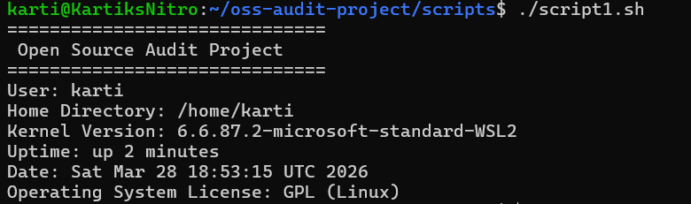
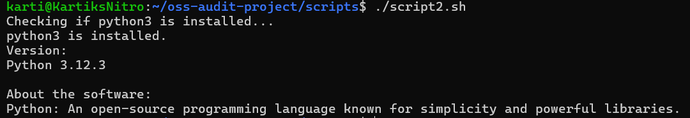
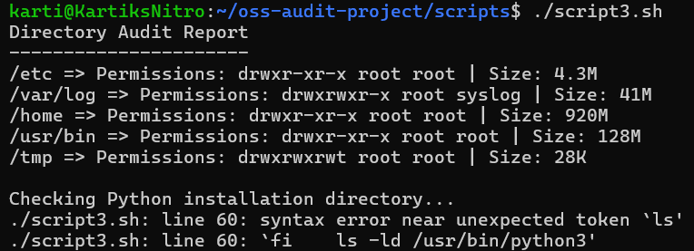
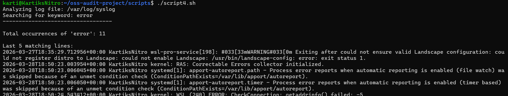
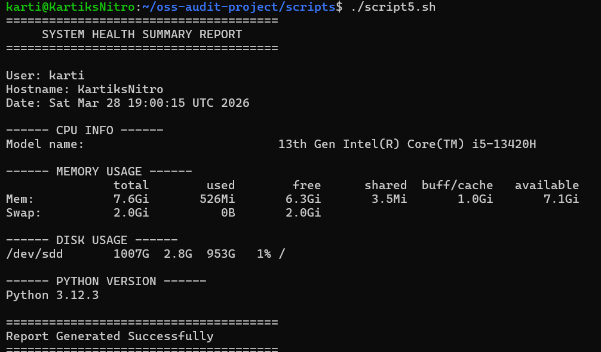

# Open Source Audit Project

## 👨‍🎓 Student Details

**Name:** Kartik Modi
**Course:** Open Source Linux (0688)
**Project Title:** Open Source Audit of Python

---

## 📌 Project Description

This project is an Open Source Software (OSS) audit focused on **Python**, a widely used open-source programming language. The project explores its origin, philosophy, ecosystem, and its integration within Linux systems.

Additionally, five Linux shell scripts have been developed to analyze system information, inspect installed packages, audit directories, analyze log files, and generate system health summaries.

---

## 🐧 Software Chosen

**Python (python3)**
Python is an open-source, high-level programming language known for its simplicity and powerful libraries. It is widely used in web development, data science, automation, and artificial intelligence.

---

## ⚙️ Requirements

* Linux Environment (Ubuntu / WSL)
* Python 3 installed
* Basic terminal access

---

## 🚀 How to Run the Project

### Step 1: Open Terminal

Navigate to the project folder:

```bash
cd oss-audit-project/scripts
```

---

### Step 2: Make Scripts Executable

```bash
chmod +x *.sh
```

---

### Step 3: Run Scripts

#### Script 1:

```bash
./script1.sh
```

#### Script 2:

```bash
./script2.sh
```

#### Script 3:

```bash
./script3.sh
```

#### Script 4:

```bash
./script4.sh
```

#### Script 5:

```bash
./script5.sh
```

---

## 📜 Description of Scripts

### 🔹 script1.sh — System Identity Report

Displays basic system information such as user, kernel version, uptime, and OS details.

### 🔹 script2.sh — FOSS Package Inspector

Checks whether Python is installed and displays its version along with a description.

### 🔹 script3.sh — Disk and Permission Auditor

Analyzes important system directories and displays permissions, ownership, and size.

### 🔹 script4.sh — Log File Analyzer

Scans Linux log files and counts occurrences of specific keywords like "error".

### 🔹 script5.sh — System Health Summary

Provides a summary of CPU, memory, disk usage, and Python version.

---

## 🐧 Linux Compatibility

This project has been fully tested and executed in a Linux environment using **WSL (Windows Subsystem for Linux)**.

---

## 📸 Output

Screenshots of all script executions are included in the project report.









---

## 📚 Open Source License

Python is distributed under the **Python Software Foundation License**, which is an open-source license.

---

## 🙌 Conclusion

This project demonstrates the understanding of open-source software concepts, Linux commands, and shell scripting techniques. It also highlights the importance of Python in the open-source ecosystem.

---
